# Projet Formation Continue : Classification des Champignons

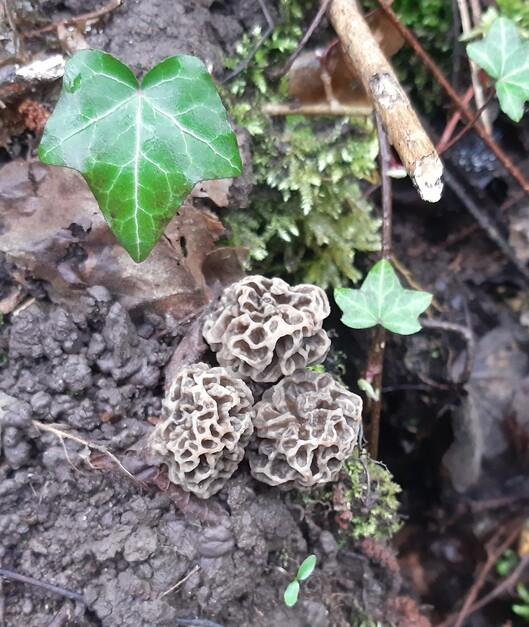  

## **📌 Mise en situation :**  
- **But :** Catégoriser les champignons en fonction de leur comestibilité, que ce soit à travers leur description (mesures ou textes) ou leur photo.  
- **Problématique :** Ne trouvant pas de base de données Open Source sur les champignons, j'ai dû aller chercher les données sur internet via scraping.  
- **Jeux de données :** [Guides des Champignons](https://www.guidedeschampignons.com/)  
- **Information :** Toutes les photos sont la propriété du site "Le guide des champignons".  

---

## **🚀 Réalisations et Méthodologie**

### 🔹 **1️⃣ Scraping des données**  
- **Objectif :** Passer de champignon en champignon et scraper le maximum d'informations (textes et photos).  
  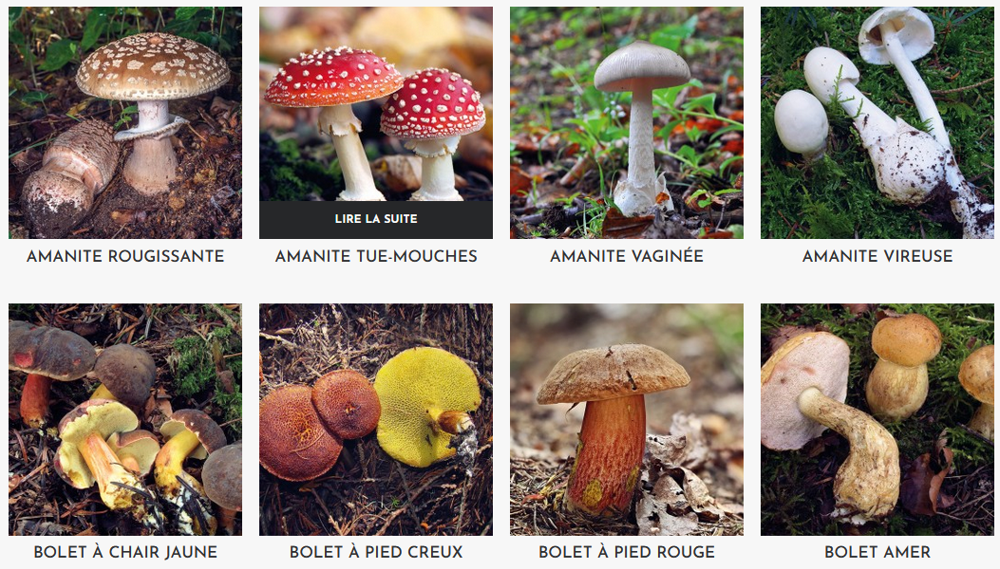  
  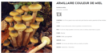  

- **Stockage :**  
  - Les données sont stockées sous format DataFrame :  
    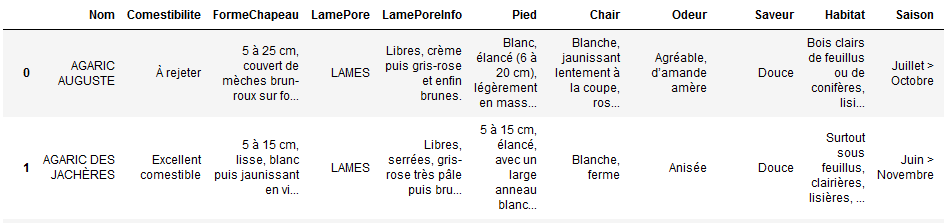  
  - Les photos sont stockées localement.  

### 🔹 **2️⃣ Analyse et nettoyage des données**  
- **Extraction des données :** Taille des chapeaux et des pieds des champignons.  
- **Saisonnalité des champignons :** Extraction de données temporelles pertinentes.  
- **Traitement NLP :** Pool des informations textuelles et extraction des mots pertinents.  
- **Visualisation des données :**  
  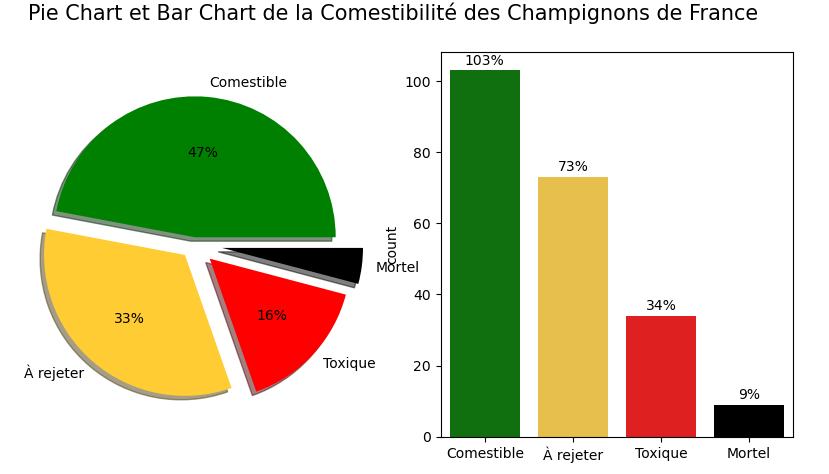  
  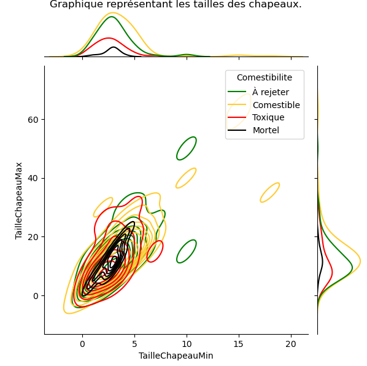  
  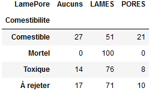  
    
  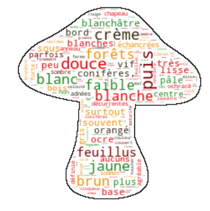  

- **Création de catégories :** Comestible et Non Comestible (en raison du faible volume de données disponibles).  
- **Stockage des données nettoyées :** Export dans une DataFrame, CSV/Excel ou MongoDB Compass.  

### 🔹 **3️⃣ Classification des champignons**  
- **Extraction des données des images :**  
  - Images avec et sans modifications via **VGG16**.  
  - Extraction des données textuelles via **TFIDF**.  
  - Création de définitions pour divers modèles de Machine Learning.  

- **Modèle non supervisé :** **KMeans**  
  - Résultats inutilisables avec un ARI proche de 0 pour les trois analyses.  
  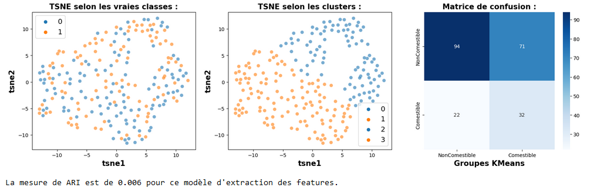  

- **Modèles supervisés :**  
  - Optimisation des hyperparamètres via **GridSearchCV** ou **BayesSearchCV**.  

- **Résultats :**  
  - Données issues des images classiques :  
    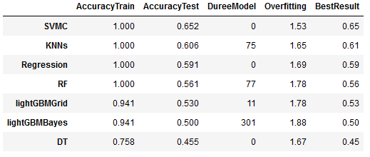  
  - Données issues des images avec **Data Augmentation** :  
    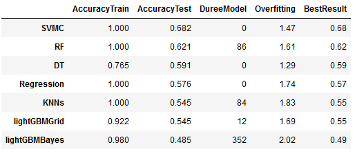  
  - Données issues des images avec **détourage** :  
    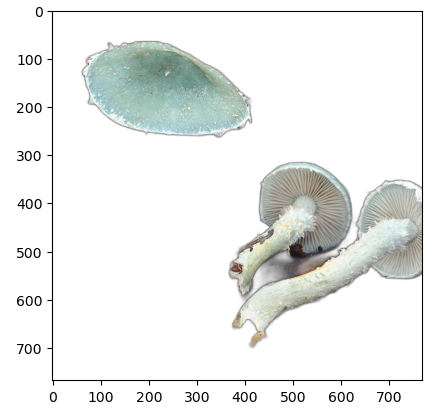  
    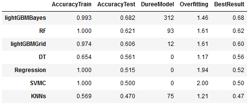  

**Note :** Les résultats sont peu concluants avec des signes évidents d'overfitting pour tous les modèles. L'optimisation via **BayesSearchCV** est également longue à réaliser.  

---

## **📈 Conclusion :**  
- **Problème de données insuffisantes :** Les résultats restent peu concluants, même en réduisant les catégories de 4 à 2 (Comestible vs Non Comestible).  
- **Proposition de solutions futures :**  
  - J'ai contacté **MycoDB** pour obtenir leurs données, mais sans réponse pour l'instant.  
  - Une amélioration possible serait d'ajouter un score personnel pour éviter que des champignons toxiques/mortels soient classés comme comestibles.  
  - Si un modèle plus robuste était disponible, une application **Streamlit** pourrait être créée pour identifier la comestibilité des champignons à partir d'une photo, avec la possibilité d'identifier même la famille avec plus de données.  

---

## **🛠️ Technologies et Outils Utilisés**  
- **Langage :** Python 🐍  
- **Librairies :** Selenium, PIL, NLTK, Spacy, Pymongo, VGG16, Scikit-learn, GridSearchCV, BayesSearchCV  
- **Environnement :** Jupyter Notebook  

---

## **📬 Contact et Feedback**  

💡 Ce projet a été réalisé dans le cadre d’une **formation continue en Data Science**. N’hésitez pas à **laisser vos suggestions** ou à me **contacter** pour en discuter !  

📩 **Contact :**  
📧 [johan.rocheteau@hotmail.fr](mailto:johan.rocheteau@hotmail.fr)  
🔗 [LinkedIn](https://www.linkedin.com/in/johan-rocheteau)
