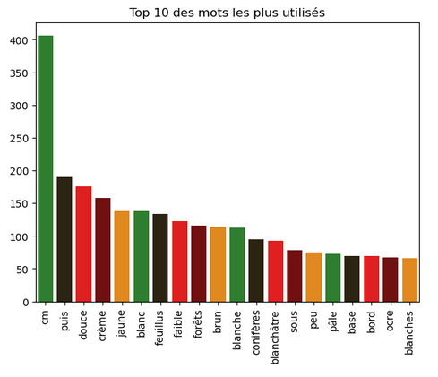

# Projet Formation Continue : Classification des Champignons

## Mise en situation :
- **But :** Catégoriser les champignons en fonction de leur comestibilité, que ce soit à travers leur description (mesures ou textes) ou leur photo.
- **Problématique :** Ne trouvant pas de base de données Open Source sur les champignons, j'ai du aller chercher les données sur internet via scraping. 
- **Jeux de données :** [Guides des Champignons](https://www.guidedeschampignons.com/)
- **Information :** Toutes les photos sont la propriété du site le guide des champignons.

## Réalisations :
- **Librairies principales :** Selenium, PIL, NLTK, Spacy, Pymongo, divers modèles de ML, VGG16, GridSearchCV, BayesSearchCV
   
- **Scrapping des données :**
	- **Objectif :** Passer de champignon en champignon et scraper le maximum d'informations (textes et photo).
      	
          
      	
	- **Stockage :**
 		- Les données sont stockées sous format DataFrame :
     		
     
   		- Les photos sont stockées sur mon ordinateur.

- **Analyse et nettoyage des données :**
	- Extraction des données chiffrées (tailles chapeaux et pieds).
 	- Extraction de la saisonnalité des champignons.
  	- Pool des diverses informations textuelles et extractions des mots pertinents via NLP.
  	- Divers graphiques, tableaux et visuels :
  	  
  	  
  	  
  	  
  	  
  	  
  	  
  	  
  	  
  	  
  	- Création de deux catégories : Comestible et Non Comestible (au vu du peu de données à ma disposition).
  	- Stockage des données dans une DataFrame Nettoyée et exportée en CSV/Excel ou sur MongoDB Compass.
  	  
- **Classification des champignons :** 
  	- Extractions des données des images avec et sans modifications via VGG16.
     	- Extraction des données textes via TFIDF.
      	- Création de définitions pour la réalisation de divers modèles de Machine Learning.
    	- Etude séparée des données textuelles, des images et des données métriques.
     	- Modèle de classification non supervisée : KMeans
        
        --> Résultats inutilisables, les ARI étant proche de 0 et ce pour les trois analyses. 	  

  	- Modèles de classification supervisées + optimisation des hyperparamètres via GridSearchCV ou BayesSearchCV.
        - Données issues des images classiques :
      
   	

	- Données issues des images avec Data Augmentation :
    
	

	- Données issues des images avec détourage :
    
	

	

	- Données issus des images avec détourage mais multiplié par 2 (concat de la DF avec elle même) :
    
	

## Analyse et Conclusion :
  - Faute de données suffisantes les résultats sont peu concluants, même en n'ayant que deux catégories (initialement j'en avais 4).
  - J'ai demandé à MycoDB si je pouvais travailler sur leurs données mais pas de réponse. Et il faut déjà 40min pour scraper les données de 250 champignons.
  - Je pourrai ajouter un score perso pour que le modèle ne nous retourne pas des champignons toxiques/mortels comme étant des bons champignons.
  - Avec un modèle robust, j'aurai pu ensuite créer une application streamlit me permettant juste en prenant la photo d'un champignon de me retourner sa comestibilité, voir même sa famille (avec suffisamment de photos). 
 
